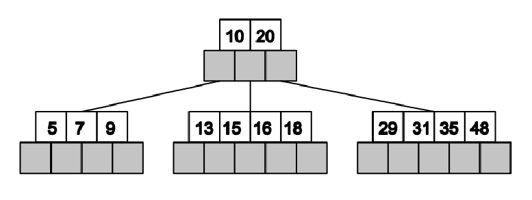
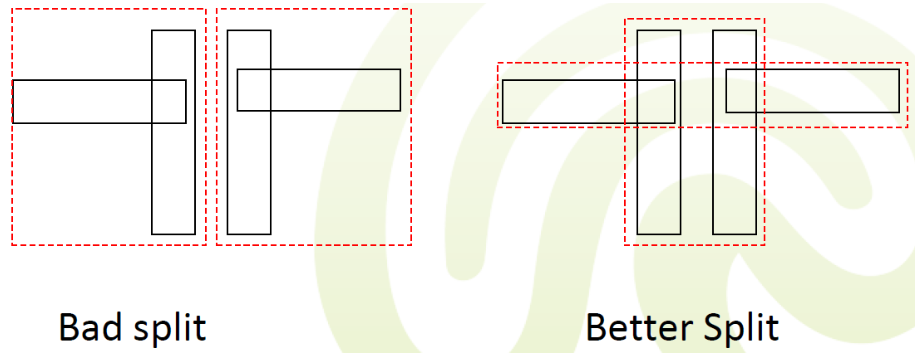

# Databáze
> Principy ukládání dat, databáze a souborové systémy. Kódování a komprese dat. Architektura relačních databází, dotazovací jazyk SQL a jeho části (definice, manipulace, transakce). Jazyk definice datového schématu, DDL. Jazyk manipulace s daty, DML. Relační algebra, integritní omezení, řízení transakcí. Indexování, hašování. Příklady z praxe pro vše výše uvedené. ([PV003](https://is.muni.cz/auth/el/fi/jaro2022/PV003/um/) || PV062)

## Principy ukládání dat, databáze a souborové systémy

Data se v praxi ukládají přímo do souborového systému, nebo do databáze (relační, dokumentové, grafové...).

### Souborový systém
- menší systémové nároky, jednodušší
- náročné zajištění konzistence, nutnost řešení zamykání souborů, problematický transakční přístup
- náročnější správa přístupových práv
- nutnost konzistentně řešit formát dat
- horší čitelnost & dokumentovatelnost datového modelu
- operační systém slouží jako abstrakce pro aplikace, umožňuje jednotný přístup k různým souborovým systémům

- pro aplikace se hodí na ukládání velkých souborů (pdf, obrázky, video, statická stránka, pokud tedy nepoužijeme CDN), které je nepraktické uchovávat v databázi. Je nutné dávat pozor, abychom neposkytli přístup jinam než chceme.

### Databázový systém
- nezávislý na aplikaci, jednotné rozhraní pro všechny
- snadné zabezpečení, konzistence, souběžný přístup
- snadná čitelnost, dokumentovatelnost
- relační systémy korelují s ERD
- deklarativní přístup
- optížná implementace složitějších struktur (záleží však na systému)
- O relačních databázích platí, že umožňují ACID [transakce](./5_databaze.md#řízení-transakcí). 

## Kódování a komprese dat

Techniky s cílem transformace informací do formátu, který je efektivní na ukládání či přenos. 

**Bezztrátová komprese** - z komprimovaných dat jsme schopni plně rekonstruovat původní data (e.g. png, zip)  
**Ztrátová komprese** - část komprimovaných dat je ztracena (e.g. jpeg, mp3), ale jsme schopni dosáhnout větší komprese

### Vybrané metody 

**Statistické**
- [Huffmanovo kódování](https://www.youtube.com/watch?v=iEm1NRyEe5c) - na základě frekvence určíme pro každý symbol kódovací znak, kód má minimální redundanci, proměnlivá délka kódu symbolů
    1. seřadíme znaky podle frekvence do prioritní fronty ve formě uzlů, u každého máme uvedenou frekvenci
    2. vyjmeme 2 uzly s nejmenšími frekvencemi a spojíme je do uzlu, který bude mít frekvenci rovnou součtu frekvencí. Takto vytváříme stromovou strukturu. Opakujeme, dokud nemáme 1.
    3. procházíme stromovou strukturu od kořene, levé větve značíme `0`, pravé `1`, cesta od kořene po uzel unikátně identifikuje symbol a kombinací `0` a `1` získáme kód pro daný symbol
    
- [Shannon-Fano](https://www.youtube.com/watch?v=dJCck1OgsIA) - podobný jako Huffman, nemusí být optimální, ale jdeme od kořene a sekvenci symbolů seřazených dle frekvence dělíme na poloviny (+-, sčítáme frekvence a při překročení poloviny dělíme), Při každém dělení značíme `0` a `1`. Jakmile je ve vytvořené polovině jen 1 symbol, už není co dělit.


## Architektura relačních databází

*Fun fact: Jaká architektura se v RDBMS používá? To se v předmětu `Architektura relačních databází` nedozvíte*

Nějaká jednoduchá architektura by mohla vypadat takto:
- databázový server 
    - přijímá, zpracovává a odpovídá na požadavky
- relační databázový systém 
    - autentizace, autorizace
    - aplikace pracující nad samotnou databází
    - umožňuje tvorbu tabulek/indexů... manipulaci s daty, jejich čtení...
    - zajišťuje integritu dat
    - vyhodnocuje a zpracovává SQL queries, provádí vnitřní optimalizace
    - může dělat kešování
- databáze - samotné místo, kde jsou data uložena

RDBMS může obsahovat techniky pro administraci přístupových práv (omezení určitých operací, viditelnost dat až na row/column level...).

Pokud se otázkou myslí *Z jakých prvků se relační databáze skládají*, pak by bylo fajn mluvit o tabulkách, sloupcích, jazyku SQL pro jejich definici (DDL, data definition language) a manipulaci (DML, data manipulation language), indexech, (materializovaných) views...

## Dotazovací jazyk SQL a jeho části (definice, manipulace, transakce)
Dotazovací jazyk SQL vychází z [relační algebry](./5_databaze.md#relační-algebra). 

Obsahuje konstrukty pro definici datového schématu, pro manipulaci s daty a pro transakční zpracování (viz další sekce).

V některých systémech má prostředky pro procedurální programování, PL/SQL (třeba Oracle).

SQL může obsahovat triggery, tedy dodatečné akce, které se mají vykonat při určitém příkazu (INSERT, UPDATE, DELETE). Používají se třeba pro udržování history table, nebo pro aktualizaci `updated_at`, pokud to nepodporuje daný RDBMS.

Při práci s SQL používáme prepared stetements, abychom zabránili SQL injection.

## Jazyk definice datového schématu, DDL.

*Note: různé RDBMS podporují různé typy. Třeba TEXT v základu SQL definován není, ale v praxi je použití VARCHAR2 s fixní délkou příliš nepraktické, proto ho tu uvádím*

Tvorba tabulky

```sql
/* Blokový koment */
-- Inline koment
CREATE TABLE Products (
    id          INT PRIMARY KEY, --třeba u pg je možné použít SERIAL, abychom si nemuseli dělat sekvence
    cost        INT NOT NULL,
    ean         INT UNIQUE NOT NULL,
    name        TEXT NOT NULL,
    description TEXT,
    created_by  INT NOT NULL REFERENCES User(id)
    updated_at  DATETIME,
);
```

V praxi je lepší si generovat vždycky primární klíče - externí unikátní hodnoty nemusí být vždy zas tak unikátní/neměnné. Je lepší používat čísla, než stringy (stačí jedna operace porovnání => rychlejší, zvlášť, když jde o PK). Compound primary key je možný, ale opět bývá pomalejší.

Pro generování dalších hodnot ID se dřív používaly sekvence, dneska stačí hodit `SERIAL`, nebo `AUTOINCREMENT`.

Pro datum/čas používáme DATETIME. Pokud bychom použili INTy & unix timestamp, v roce 2038 bychom měli problém.

U cizích klíčů můžeme specifikovat `ON DELETE` `CASCADE` (se smazáním uživatele se smažou i jím přidané produkty), `SET NULL` (se smazáním uživatele se nastaví `created_by` na NULL, což ale kvůli našemu constraintu nepůjde). V aktuální konstelaci daného uživatele nemůžeme smazat.

Modifikace tabulky
- přidání sloupce, odebrání sloupce, zahození tabulky (selže, pokud na ni jsou reference z jiných tabulek)
```sql
ALTER TABLE Products ADD picture TEXT;
ALTER TABLE Products DROP COLUMN description;
DROP TABLE Products;
```

Je možné použít `IF EXISTS` a `IF NOT EXISTS`, aby nám skript nepadal při opakovaných createch/dropech, ale to se hodí hlavně pro hraní si.

V produkci použijeme migrační schéma obsahující UP a DOWN skripty, abychom mohli případně akce revertovat.

## Jazyk manipulace s daty, DML.

**Insert**

```sql
INSERT INTO Tabulka(sloupec_a, sloupec_b) 
VALUES (hodnota_a, hodnota_b);
```

Kontrolují se integritní omezení, v případě autoincrement/serial klíče ho není nutné explicitně uvádět. Obvykle příkaz vrací vložená data (včetně vygenerovaných hodnot).

**Update**

```sql
UPDATE Tabulka 
SET slopec_a = hodnota_a
WHERE ... --často klíč
```

Update bez WHERE může provést update všeho. Kontrolují se integritní omezení

**Delete**

```sql
DELETE FROM Tabulka WHERE ...
```

Delete bez WHERE může provést smazání celého obsahu

**Select**

Trochu nabušený select:

```sql
SELECT DISTINCT Tabulka.sloupec, B.sloupec FROM Tabulka
JOIN TabulkaB AS B ON Tabulka.cizi_id = B.id
WHERE price > 0
ORDER BY sloupec ASC
```
*Join jde přepsat pomocí WHERE*

Výsledek selectu lze dát do závorek a použít namísto nějaké tabulky, data mají pořád tabulární strukturu.

Mezi daty se stejnou strukturou lze provést množinové operace `UNION`, `INTERSECT`, `MINUS`.

U `WHERE` můžeme používat i příslušnost v množině hodnot `IN`, rozsahu `BETWEEN ... AND ...`, logické operátory `AND`, `OR`... U stringů `LIKE` kde `?` zastupuje znak a `%` několik znaků.

**Pohled/View**

- Uložený a pojmenovaný select, který se vykoná s provedením dotazu
- view mají omezenou modifikaci dat (například nelze, pokud obsahuje agregaci, distinct, union...)
    => je lepší použít zdrojové tabulky

**Materializovaný pohled/view**

- View, jehož výsledek se předpočítává. Vrací se pak hodnoty přímo z nové tabulky, ale s každou změnou je třeba materializované view přepočítat (rychlejší čtení, pomalejší zápis).

**Agregační funkce**

Používané s `GROUP BY sloupec/sloupce`

*Pokud nepoužijeme `GROUP BY`, počítají se agregační funkce ze SELECTu*

- `COUNT(...)` - počet řádků, lze použít `COUNT(*)`
- `AVG(...)`
- `SUM(...)`
- `MIN(...)`
- `MAX(...)`

Lze použít `HAVING ...`, což je `WHERE`, ale s použitím agregačních funkcí.

## Relační algebra
> *[@thes01](https://github.com/thes01): více taky na [tomto odkazu (bc státnice)](https://docs.google.com/document/d/1SVbwwMDDfOCqAdsfTH1RDJex9_fZZ96wb0Vp2fSoUFs/edit)*

**Relace** je podmnožinou kartézského součinu domén. Toto se promítne do databáze tak, že domény jsou datové typy sloupců a tabulka (složená ze sloupců) obsahuje pouze takové kombinace hodnot (řádky), jaké jsou v relaci.

Pro relační operace používáme relační algebru skládající se z 
- **množinových operací** (ale pro sjednocení, rozdíl a průnik musí být relace kompatibilní, i.e., mít stejnou hlavičku)
- **projekce** - i.e. výběr sloupců
- **selekce** - i.e. WHERE
- **přejmenování** - AS
- **spojení/join/součin relací** - JOIN
- **seskupení a agregace** - GROUP BY, AVG(...)...
...jednotlivé operace tedy odpovídají dotazovacímu jazyku SQL.

Existují dotazy, které nejsme schopní vyjádřit relační algebrou, třeba tranzitivní uzávěr.

*Tranzitivní uzávěr nad relací získáme tak, že se díváme na prvky množiny v relaci. Pokud je `a` v relaci s `b` a `b` v relaci s `c`, pak (aby bylo dosaženo tranzitivity) tranzitivní uzávěr obsahuje relaci `a` s `c`.*

## Integritní omezení

Součástí DDL, jazyku definice dat. Určitým způsobem omezují, jakých hodnot mohou pole nabývat. E.g. `NOT NULL`, `UNIQUE`, `FOREIGN KEY .. RERERENCES ..(..)`, `CHECK(price>0)`... Uvádí se na příslušný řádek (ideálně), tabulky, jako dodatečný řádek tabulky, nebo jako samostatný výraz `ALTER TABLE .. ADD CONSTRAINT ... NOT NULL (id)`.

## Řízení transakcí.

Transakce v RDBMS mají ACID vlastnosti
- **Atomicity** - skupina příkazů transakce brána jako jednotka; provedou se všechny, nebo žádný
- **Consistency** - po vykonání transakce ke db v konzistentním stavu, není porušeno žádné integritní omezení
- **Isolation** - transakce je izolovaná od ostatních transakcí, je možné nastavit úrovně transakce, dle toho může transakce skončit chybou (pokud došlo k modifikaci stejného objektu, jaký modifikovala jiná transakce), nebo se využijí zamykací mechanismy
- **Durability** - data jsou po vykonánání transakce persistentně uložena

Transakce se potvrzují příkazem `COMMIT`, vrací příkazem `ROLLBACK` na stav před započením transakce, či po poslední `SAVEPOINT` 

## Indexování

Index slouží ke zrychlení/zefektivnění častých dotazů nad tabulkou. Dotazy obsahující zvolený sloupec (či jejich kombinaci) budou rychlejší.

```sql
CREATE INDEX my_index ON Products (Price)
```

Pro indexy se mohou používat 
- **tradiční indexy** - jako v knihách, odkazy na řádky s danou hodnotou, je možné dělat více úrovní indexů, používat různá indexová uspořádání...
- **haše** - pro získání jednoduché hodnoty velkých dat
- **B+ stromy** - každý uzel obsahuje odkazy na uzly níže, nebo hodnoty (jedná se o listový uzel). Hodnoty jsou v listech vzestupně uspořádány, uzly v sobě mají i informace o intervalech daných odkazů/hodnot, listy jsou provázané.
    
- **R stromy** - podobné jako B+, ale jsou vícedimenzionální, ve 2D fungují jako obdélníky. Data jsou v listových uzlech stromu. Rodič uzlu zahrnuje všechny své potomky (ve 2D jde o větší obdélník, který obsahuje potomky). Ideální je, aby zabíraly rodičovské obdélníky co nejméně prostoru - rodič totiž jako index redukuje oblast nutnou k prohledání (říká *hledej ve mně!*).
    
    

Další dělění indexů
- **dense** - každý řádek je zaindexovaný, zabírá více místa, ale hledání je rychlejší
- **sparse** - pouze některé řádky zaindexované, zabírá méně místa, ale hledání pomalejší (je potřeba dohledat konkrétní řádek)

## Hašování

**Cílem hašování je převést vstupní data libovolné délky na výstup jednotné délky (fixed-length řetězec, nebo číslo), hash.** Z heshe by nemělo být možné odvodit vstup (**jednosměrnost**), pro každý vstup bychom měli být schopni deterministicky (vstupem jsou pouze data) určit jediný hash. Zároveň může být (dle použití) cílem minimalizovat riziko kolize, tedy že dva vstupy mají stejný hash (nelze se tomu ale vyhnout, protože musíme být schopni mapovat nekonečno možných vstupů na omezený počet výstupů daný délkou). Dle použití může být také důležité, aby podobné vstupy měli zásadně rozdílné heše, aby bylo možné snadno odhalit drobnou (záměrnou či nechtěnou) modifikaci vstupu. Pro prolamování hašů se použávají rainbow tables, obsahující pro daný algoritmus známé vstupy a jejich haše.

Hašování se používá pro zajištění integrity dat (certifikáty, checksum), rychlé porovnávání dat (HashMap), porovnávání dat se znalostí pouze heše (uchovávání hash hesel v databázi, Argon2).

**Bezkoliznost**
- **slabá** - pro vstup A nejsme schopni v rozumném čase nalézt rozdílný vstup B, který by měl stejný hash
- **silná** - nejsme schopni v rozumném čase najít libovolné dva rozdílné vstupy se stejným hashem 

Pro různé účely používáme různé algoritmy, jde o balanc rychlosti (u hesel může je kýžená pomalost) a bezpečnosti/pravděpodobnosti kolize.
- **MD5** - relativně rychlý, není bezpečný (lze rychle najít kolize i na běžném počítači). 
- rodina Secure Hashing Algorithm, za bezpečnou se aktuálně považuje **SHA-2** (SHA256, SHA512, SHA-384...)
- **Argon2** - v současnosti doporučovaný pro hašování hesel
- hašem (hloupým, ale rychlým) může být třeba i délka vstupu, modulo, součet ascii hodnot znaků... (nazývá se [Cyclic redundancy check](./dev_3_bezpecny_kod.md#notes))
