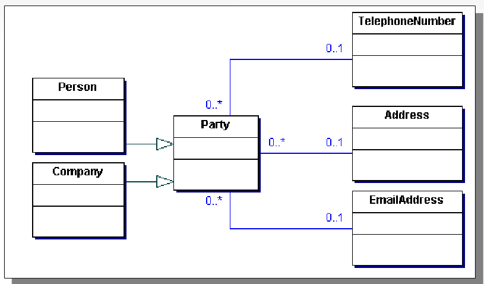
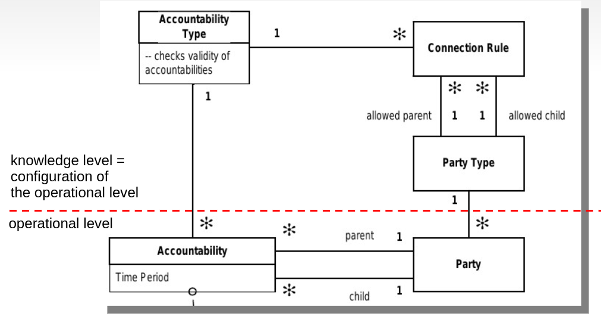

# Analýza a návrh systémů

> Objektové metody návrhu informačních systémů. Specifikace a řízení požadavků. Softwarové architektury, komponentové systémy. Návrhové a architektonické vzory. Rozhraní komponent, kontrakty na úrovni rozhraní, OCL. Modely softwarových systémů, jazyk UML. Příklady z praxe pro vše výše uvedené. ([PA103](https://is.muni.cz/auth/el/fi/podzim2021/PA103/um/), PV167, PV258)

## Objektové metody návrhu informačních systémů.

Přístupy a postupy k návrhu IS založených na objektově orientovaném paradigmatu, kde jsou objekty spojením dat a metod nad těmito daty.

Mezi metody se řadí modelování domény pomocí [UML](./dev_1_analyza_a_navrh.md#modely-softwarových-systémů-jazyk-uml), dekompozice systému do menších, koherentních částí, v různých částích vývoje se zabýváme různými úrovněmi detailů. Dále se aplikují návrhové a architektonické vzory, které popisují řešení na dobře známé a často se opakující problémy v (nejen) objektovém světě.

TODO popiš úrovně a použité diagramy, detaily diagramů tady nerozebírej
Fáze vývoje a používané diagramy:
- Analýza požadavků - [Use Case](./dev_1_analyza_a_navrh.md#use-case-diagram), [Conceptual Class Diagram](./dev_1_analyza_a_navrh.md#conceptual-class-diagram)

TODO.

## Specifikace a řízení požadavků.
TODO

## Softwarové architektury, komponentové systémy.
TODO

## Návrhové a architektonické vzory.

Accountability vzory *(přijdou mi ve slajdech popsány složitější, než jsou, proto popisuju koncepty/zapamatovatelné aspekty, zbytek si člověk dokáže odvodit. Odkazy vedou na příslušnou část s diagramem.)*
- [Party](./dev_1_analyza_a_navrh.md#party) - společný název (abstrakce) pro osobu či firmu, obvykle má kontaktní údaje (adresu, telefon, email...)
- [Organization Hierarchies](./dev_1_analyza_a_navrh.md#organization-hierarchies) - řešíme problém reprezentace organizace skládající se z často měnících se hierarchií organizačních jednotek (e.g. Korporace, Region, Pobočka, Oddělení... typy jednotek mohou být také předmětem změn). Řešením je stavební blok `Organizace`, která má 0..1 rodiče `Organizace` a  0..n potomků `Organizace` (rekurzivní vazba). Jednotlivé typy oddělení pak mohou dědit od `Organizace`.
- [Organization Structure](./dev_1_analyza_a_navrh.md#organization-structure) - To samé co organization hierarchies, ale přidáváme k tomu `TimePeriod` (pro verzování v čase), `Typ Organizační Struktury`, který může mít `Pravidla` zajišťující, že třeba oddělení nebude nadřízené divizi.
- [Accountability](./dev_1_analyza_a_navrh.md#accountability) - Organization Structure, ale Organizaci nahradíme Party (a vztahu říkáme accountability). Je tam opět `TimePeriod`, ale `Typ Organizační Struktury` se jmenuje `Accountability Type`. `Pravidla` pro vazby zahazujeme
- [Accountability Knowledge Level](./dev_1_analyza_a_navrh.md#accountability-knowledge-level) - Accountability, ale `Pravidla` pro vazby mezi jednotlivými `Party`s zase přidáme. `Pravidla` jsou definována pro jednotlivé `Accountability Type`s, každé definuje povolenou kombinaci `Party Type` potomka a rodiče v hierarchii. Úrovni, kde popisujeme pravidla (a kde tím pádem jsou i `Accountability Type`s a `Party Type`s) říkáme knowledge level, existuje jen pro zajištění správné kompozice (ale nemá moc význam pro day-to-day operace).

Příklad pro aplikaci accountability je ve [slajdech (str 35+)](https://is.muni.cz/auth/el/fi/podzim2021/PA103/um/02-03-Analysis-patterns.pdf#page=35).

TODO

## Rozhraní komponent, kontrakty na úrovni rozhraní
TODO

## OCL.
TODO

## Modely softwarových systémů, jazyk UML.

Modely sw systémů popisují systém vždy z nějakého zjednodušeného pohledu (model je už z definice abstrakce). Různé modely se zabývají různými aspekty/fázemi vývoje systému. Důležité však je, aby byly modely systému vzájemně konzistentní. Obecně lze rozlišovat na modely popisující strukturu a modely popisující chování.

### Use case diagram
TODO

### Conceptual class diagram

Diagram tříd, ale neřešíme datové typy ani metody. Zajímají nás klíčové entity (struktury/třídy), jejich data plynoucí z požadavků, a vazby mezi entitami (kontext). Pomáhá ujasňovat terminologii.

TODO

## Notes

**Motivace objektových metod/návrhových vzorů**
- Systémy bývají složité, špatně se udržují a je náročné měřit/zajistit kvalitu, často se mění nároky
=> pomůže dekompozice systému do menších koherentních částí, které se lépe udržují/mění, snadněji se měří kvalita

Dekompozice podle [SOLID](./2_kvalita_kodu.md#solid-principy)
- single responsibility - každý modul/třída/funkce by se měly soustředit pouze na jednu část funkcionality (a tu zapouzdřovat)
- open/closed - každý modul/třída/(funkce) by měly být rozšiřitelné i.e. přidání změn způsobí minimální modifikaci kódu, většinou rozšiřujeme pomocí nových tříd/metod
- liskov substitution - každý (dědičně) nadřazený objekt by měl být nahraditelný podřazeným objektem, aniž by byl narušen původní kontrakt. E.g. nemůžeme vyhodit výjimku, když to nadřazený nikdy nedělal. Nemužeme brát u stejné metody konkrétnější argument, než jaký bere nadřazený objekt (je v pohodě brát abstraktnější). Nemůžeme vracet abstraktnější typ, než jaký vrací nadřazený. Je v pohodě přidávat funkcionalitu ve formě dalších metod.
- interface segregation - rozbíjíme velká rozhraní na menší, logicky související jednotky. Jen to, co klient opravdu může potřebovat.
- dependency inversion - závisíme na abstrakcích (rozhraní), ne na konkrétních implementacích

**Problém s cyklickou vazbou objektů** - e.g. v metodě toString() je potřeba vhodně řešit, abychom se necyklili. Proto může být vhodnější definovat si pro takové případy speciální objekty s jasnou hierarchií a bez cyklů

### Diagramy jednotlivých návrhových vzorů

#### Party

#### Organization Hierarchies

#### Organization Structure

#### Accountability

#### Accountability Knowledge Level
